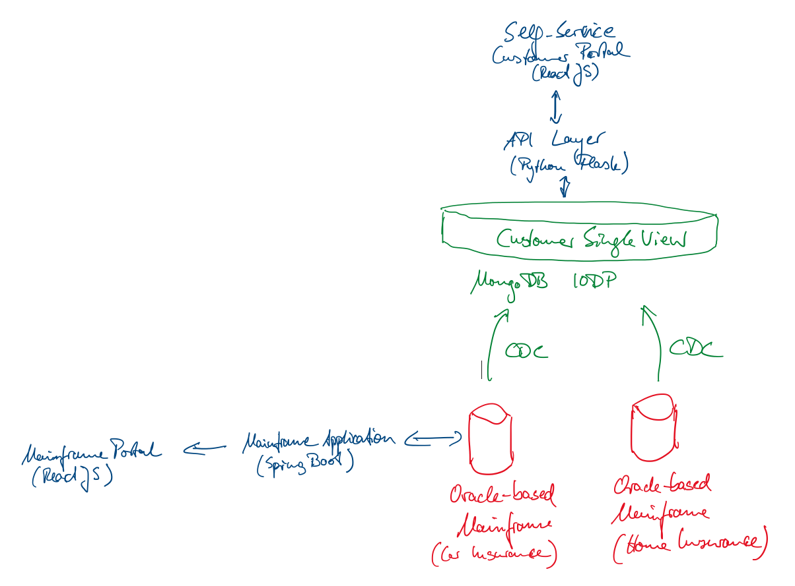
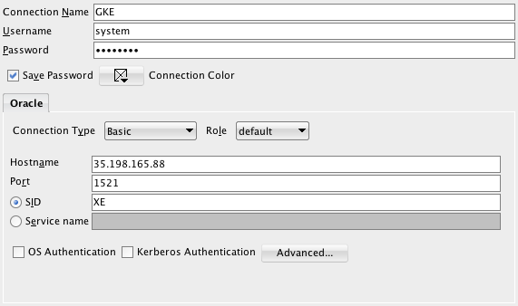

# MongoDB Demo: How to create a Single View of Customer in order Modernize Legacy Sytems, Mainframe Offloading and creating a Microservices Architecture

MongoDB is used by many large organizations to build mission-critical applications - lowering TCO, increasing developer productivity, de-risking development phases and therefore enabling companies to leverage data and technology for competitive advantage.

This project demonstrates how to create a Single of Customer based on an example in the insurance sector. A large-scale example of unifying more than 100 million individual customers is [MetLife](https://www.mongodb.com/customers/metlife): a working prototype has been built in just two weeks, three months later the project has been in production. This demonstration explains three major use cases:

* **Mainframe Offloading:** Release legacy mainframes from MIPS intensive workloads by offloading data and processes to a modern scalable data layer allowing you to reduce cost and enable new use cases demanded by business.
* **Single View of your business:** Centralize, organize and present your business relevant information from various sources and channels to serve the business demands like 360 customer view, Single source of Risk or centralized governance.
* **Legacy Modernization:** Address the range of new business requirements and modernize in an agile, highly efficient, scalable & timely manner.

## TODOs for easier usage and installation:
* Dynamically pass the API endpoint of mainframe-service to the mainframe-portal (APIUtils.js). What the best way to achieve this in dynamically in Kubernetes?
* Dynamically pass the API endpoint of insurance-service to the insurance-portal (APIUtils.js). What the best way to achieve this in dynamically in Kubernetes?
* Automatically create the necessary indexes in MongoDB in the CDC process.
* Further automate the deployment process (as outlined below - Sergi already did some great work).

## Demo Overview

The demo is based on example data that is publicly available. Home insurance data is taken from [Kaggle: 2007-2012 polices of a Home Insurance company](https://www.kaggle.com/ycanario/home-insurance). Car insurance data is based on some claims provided by [EmcienScan](http://www.scan-support.com/help/sample-data-sets). The direct download is also available: [Automobile Insurance claims including location, policy type and claim amount](http://dyzz9obi78pm5.cloudfront.net/app/image/id/560ec66d32131c9409f2ba54/n/Auto_Insurance_Claims_Sample.csv). Some slight modifications have been performed in order to provide a more complex relational structure and showcase some real-world challenges.

The following picture outlines the scenario: Insurance data is spread in two different legacy applications split up into car and home insurances (potentially mainframes, files, or other database systems). 



For the car insurances, there is a legacy application available to list customers and to create new insurance policies as well as claims.


A single view of customer aggregating both types of insurance policies and claims into one document per customer is built up in MongoDB. Two CDC processes are in place to update the data in MongoDB as soon as a change is performed in the underlying legacy database systems. We leverage the embedding pattern here, there are several other [Schema Design Patterns](https://www.mongodb.com/blog/post/building-with-patterns-a-summary) that can be used in such projects. We also make use of polymorph documents, i.e. documents can be of different shapes wihtin one collection. This is the case, if only type of insurance policy exists as well as if there are multiple policies of each types with/without claims.


The customers are provided with a self-service portal that they can use in their web browser. The API layer ensures that the same RESTful endpoints can be used for any additional application, e.g. a mobile app.

# Deployment

## Containerized Environment, e.g. Google Kubernetes Engine or OpenShift

__0. Preconditions__

A working Kubernetes cluster exists. All operations assume that we use Google Kubernets Engine. All commands assume that you are in the root directory of this repository and a cluster ```mdb-insurance-demo``` has been spun up in zone ```europe-west3-a``` it belongs to the project ```ckurze-k8s-operator-234311```. The Google Cloud offers a very good free tier - so just get started.

Login to Google Cloud (this will open a browser window to authenticate yourself against GCP):
```
gcloud auth login
```

Set the proper Kubernetes Context:
```
gcloud config set project ckurze-k8s-operator-234311
gcloud config set compute/zone europe-west3-a
```

Get the creentials and work with the new cluster:
```
gcloud container clusters get-credentials mdb-insurance-demo
```

Some operations require admin privileges, so create a cluster-admin role binding:
```
kubectl create clusterrolebinding cluster-admin-binding --clusterrole cluster-admin --user <YOUR.GCP.ACCOUNT@gmail.com>
```

__1. Install Mainframe / Oracle__

Create a secret that contains the `system` password for Oracle. Change it in `mainframe-oracle/deployment/oracle-pass-secret.yaml` (defaults to `qwer1234`) and create the secret via:
```
kubectl apply -f mainframe-oracle/deployment/oracle-pass-secret.yaml
```

In order to install Oracle, we provide two mechanisms. The first one uses ephemeral storage, i.e. as soon as the Oracle pod is killed, all the data will be removed. Using persistent volume claims in the second option, data will be available after pod restarts.

__1.1 Option 1: Create Ephemeral Oracle Instance in Kubernetes__

The insurance core system runs on Oracle today. The demo will use a containerized version. It can be installed as following (be sure to create the secret first, as outline above):
```
kubectl apply -f mainframe-oracle/deployment/ephemeral/oracle-deployment.yaml 
```

Double-check that the pods and service have been created:
```
kubectl get pods
NAME       READY     STATUS    RESTARTS   AGE
oracledb   1/1       Running   0          4m

kubectl get services
NAME               TYPE           CLUSTER-IP     EXTERNAL-IP      PORT(S)          AGE
kubernetes         ClusterIP      10.23.240.1    <none>           443/TCP          54m
oracledb-service   LoadBalancer   10.23.251.48   35.242.219.126   1521:31039/TCP   23m
```

__1.2 Option 2: Create Persistent Oracle Instance in Kubernetes__

The insurance core system runs on Oracle today. The demo will use a containerized version which uses a statefulSet with a persistent volume. It can be installed as following (be sure to create the secret first, as outline above):

```
kubectl apply -f mainframe-oracle/deployment/persistent/oracle-deployment.yaml 
```

Double-check that the pods and service have been created:
```
kubectl get all
pod/oracledb-774446f779-pr9lf    1/1     Running   0          102s

NAME                        TYPE           CLUSTER-IP      EXTERNAL-IP    PORT(S)          AGE
service/kubernetes          ClusterIP      10.55.240.1     <none>         443/TCP          51m
service/oracledb-service    LoadBalancer   10.55.245.171   <pending>      1521:30371/TCP   102s

NAME                        DESIRED   CURRENT   UP-TO-DATE   AVAILABLE   AGE
deployment.apps/oracledb    1         1         1            1           102s

NAME                                   DESIRED   CURRENT   READY   AGE
replicaset.apps/oracledb-774446f779    1         1         1       102s
```

__1.2 Create the Schemata in Oracle for Car and Home Insurance__

TODO: These steps should be futher automated to avoid manual intervention during demo setup.

Connect to Oracle, e.g. via SQLDeveloper, using the EXTERNAL-IP of the oracledb-service outlined above on PORT 1521. Username is ```system```, the password is ```qwer1234``` (as defined in ```mainframe-oracle/deployment/oracle-pass-secret.yaml```). 



Execute the following commands in SQLDeveloper that will create two users/schemas in Oracle for car and home insurance, respectively:

```
CREATE USER carinsurance IDENTIFIED BY carinsurance;
CREATE USER homeinsurance IDENTIFIED BY homeinsurance;

GRANT ALL PRIVILEGES TO carinsurance;
GRANT ALL PRIVILEGES TO homeinsurance;
```

__1.3 Generate the Sample Data__

TODO: These steps should be futher automated to avoid manual intervention during demo setup.

The generation of sample data is performed in three steps:
* Generate the Customers to a CSV file in the output directory
* Generate Car Insurance Data and upload into Oracle as well as CSV files in the output directory
* Generate Home Insurance Data and upload into Oracle as well as CSV files in the output directory

__Important:__ Ensure that the target tables in Oracle do not exist, otherwise the generators throw an error. In case you need to drop them, execute the following statements as system user:
```
DROP TABLE HOMEINSURANCE.CLAIM;
DROP TABLE HOMEINSURANCE.CUSTOMER;
DROP TABLE HOMEINSURANCE.POLICY;
DROP TABLE HOMEINSURANCE.POLICY_COVERAGE;
DROP TABLE HOMEINSURANCE.POLICY_OPTION;
DROP TABLE HOMEINSURANCE.POLICY_RISK;

DROP TABLE CARINSURANCE.CAR_CLAIM;
DROP TABLE CARINSURANCE.CAR_CUSTOMER;
DROP TABLE CARINSURANCE.CAR_POLICY;
```

The following commands need to be executed to generate the data and load it into Oracle (there will also be a CSV version of the data in the ```output``` directory):
```
cd mainframe-dataloader/

# We recommend to generate 80k customers to have a meaningful example. For smaller demonstration purposes, it can be less.
python faker_customers_to_csv.py 80000

# Generate Car Insurance (Schema: CARINSURANCE, Password: carinsurance)
# Usage: python faker_car_insurance.py <ORACLE_HOST> <ORACLE_PORT> <ORACLE_SYSTEM_PASSWORD> <NUMBER_OF_CUSTOMERS>
# Note: Due to the internal selection of customers (birth dates should match the insurance start date, etc.) the actual number
#       of generated customers can be lower than the number provided here, so please add a buffer of 25%.
python faker_car_insurance.py ORACLE_IP 1521 qwer1234 50000

# Generate Home Insurance (Schema: HOMEINSURANCE, Password: homeinsurance)
# Usage: python faker_home_insurance.py <ORACLE_HOST> <ORACLE_PORT> <ORACLE_SYSTEM_PASSWORD> <NUMBER_OF_CUSTOMERS_MAX_256136>
# Note: Due to the internal selection of customers (birth dates should match the insurance start date, etc.) the actual number
#       of generated customers can be lower than the number provided here, so please add a buffer of 25%.
#       The maximum number is 256136, as the file home_insurance.csv is taken as a basis and it contains 256136 rows.
python faker_home_insurance.py ORACLE_IP 1521 qwer1234 50000
```
__1.4 Apply SQL Triggers and Key Constraints__

TODO: These steps should be futher automated to avoid manual intervention during demo setup.

Create Primary and Foregin Keys as well as Triggers in Oracle to reflect Change Data Capture.
Execute the SQL code provided in ```home_insurance_oracle_triggers_and_keys.sql``` as well as ```car_insurance_oracle_triggers_and_keys.sql``` in the ```oracle_sql_triggers_keys``` folder. These scripts will create triggers that update the last_change timestamp for each insert or update as well as foreign keys for the sake of completeness.

__2. Install MongoDB OpsManager & MongoDB ReplicaSet__

Install a MongoDB OpsManager following the instructions of [Install a Simple Test Ops Manager Installation](https://docs.opsmanager.mongodb.com/current/tutorial/install-simple-test-deployment/)

__2.1 Generate API Key and Configure IP Whitelist for External Access to OpsManager API__

* Log in to OpsManager
* Click your username in the top right of the screen and choose Account
* Click the tab Public API Access
* Generate a new API Key and store it somewhere save (remeber, it is like a password)
* Add a whitelist entry for your Kubernetes Cluster (for GCP you find it when you click on your Kuberentes Cluster in Google Console -> Endpoint (e.g. 35.198.84.76 - the Whitelist entry should be 35.0.0.0/8).

__2.2 Install MongoDB Enterprise Kubernetes Operator into Your Cluster__

* Create the namespace ```mongodb``` via ```kubectl create namespace mongodb```
* Follow the instructions outlined in [Install the MongoDB Enterprise Kubernetes Operator](https://docs.mongodb.com/kubernetes-operator/stable/tutorial/install-k8s-operator/)
  __Note:__ If you deploy into an OpenShift environment, remember to set the parameter ```MANAGED_SECURITY_CONTEXT``` to ```'true' ``` (note the quotes).

Example ```samples/project.yaml``` file: 
```
---
apiVersion: v1
kind: ConfigMap
metadata:
  name: my-project
  namespace: mongodb
data:
  projectName: InsuranceDemo
  baseUrl: http://ec2-XXX-XXX-XXX-XXX.eu-central-1.compute.amazonaws.com:8080
```

Example call to create credentials:
```
kubectl -n mongodb \
  create secret generic my-credentials \
  --from-literal="user=christian.kurze@mongodb.com" \
  --from-literal="publicApiKey=XXXXXXX-XXXX-XXXX-XXXX-XXXXXXXXXXX"
```

__2.3 Install a MongoDB ReplicaSet__

Modify the file ```samples/minimal/replica-set.yaml```:
```
---
apiVersion: mongodb.com/v1
kind: MongoDB
metadata:
  name: my-replica-set
  namespace: mongodb
spec:
  members: 3
  version: 4.0.10
  type: ReplicaSet

  project: my-project
  credentials: my-credentials

  persistent: true
  
  # log level affects the level of logging for the agent. Use DEBUG cautiously as log file size may grow very quickly
  logLevel: ERROR

  persistent: true
  podSpec:
    cpu: '0.5'
    memory: 512M
    # "multiple" persistence allows to mount different directories to different Persistent Volumes
    persistence:
      single:
        storage: 1Gi
```

Execute the command:
```
kubectl apply -f samples/minimal/replica-set.yaml 
```

If any errors occur, check the logs of the pods forming the workload ```mongodb-enterprise-operator``` or, if the database starts to get created, of ```my-replica-set```.

__3. Configure Data Load from Oracle to MongoDB__

TODO: We need to create a litte routine that creates an index on insurance.customer: { customer_id: 1 } for the data load to be efficient.

Once Oracle and MongoDB are up and running, the data loader can be initialized. Modify the file ```etl-mainframe-mongodb/deployment/deployment-etl.yaml```:
```
apiVersion: apps/v1
kind: Deployment
metadata:
  name: etl-mainframe-mongodb
  labels:
    app: etl-mainframe-mongodb
spec:
  replicas: 1
  selector:
    matchLabels:
      app: etl-mainframe-mongodb
  template:
    metadata:
      labels:
        app: etl-mainframe-mongodb
    spec:
      containers:
        - name: etl-mainframe-mongodb
          image: ckurze/etl-mainframe-mongodb
          env:
            - name: MONGO_URI
              value: mongodb://my-replica-set-0.my-replica-set-svc.mongodb.svc.cluster.local:27017,my-replica-set-1.my-replica-set-svc.mongodb.svc.cluster.local:27017,my-replica-set-2.my-replica-set-svc.mongodb.svc.cluster.local:27017/test?replicaSet=my-replica-set
            - name: ORACLE_URI
              value: jdbc:oracle:thin:@//IP_OR_HOSTNAME_OF_ORACLE:1521/XE
```

Execute the command:
```
apply -f etl-mainframe-mongodb/deployment/deployment-etl.yaml
```

__4. Install Mainframe Simulation__

The following steps will install a service to encapsulate the mainframe. It is a Spring Boot application in combination with a web application designed to look like a mainframe.

__4.1 Install Mainframe Service__

Install the deployment as well as the service into the Kubernetes cluster. It will map the service to port 8080:
```
kubectl apply -f mainframe-service/deployment/mainframe-deployment.yaml
```

The public IP address will depend on the service creation. The following endpoints should work now:
```
# List of all customers:
http://35.234.79.XXX:8080/car/customer/all

# Individual customer (id must exist, copy from an arbitrary customer of the /all endpoint:
http://35.234.79.XXX:8080/car/customer/C000014831

# Individual policy:
http://35.234.79.XXX:8080/car/policy/PC_000000002
```

__4.2 Install Mainframe Web Application__

TODO: We need to inject the correct API endpoint via variables to `APIUtils.js`. Until this is done, please modify `APIUtils.js` of the web application to point to the previously deployed endpoint. What the best way to achieve this in dynamically in Kubernetes?

Install the Docker image into a pod as well as a service:
```
kubectl apply -f mainframe-portal/deployment/deployment.yaml
kubectl apply -f mainframe-portal/deployment/service-gce.yaml
```

The public IP address will depend on the service creation. The following endpoints should work now:
```
# Mainframe Car Insurance Portal:
http://35.246.238.250:30100 
```

__5. Install Modern Insurance Portal__

__5.1 Install Insurance Service__

Adopt the configuration of ```insurance-service/deployment/insurance-service-deployment.yaml``` to match the MongoDB ReplicaSet in your Kubernetes Cluster:
```
apiVersion: apps/v1
kind: Deployment
metadata:
  name: insurance-service
  labels:
    app: insurance-service
spec:
  replicas: 1
  selector:
    matchLabels:
      app: insurance-service
  template:
    metadata:
      labels:
        app: insurance-service
    spec:
      containers:
      - name: insurance-service
        image: ckurze/insurance-service
        ports:
        - containerPort: 4000
          protocol: TCP
        env:
        - name: ENV
          value: "development"
        - name: PORT
          value: "4000"
        - name: DB
          value: "mongodb://my-replica-set-0.my-replica-set-svc.mongodb.svc.cluster.local:27017,my-replica-set-1.my-replica-set-svc.mongodb.svc.cluster.local:27017,my-replica-set-2.my-replica-set-svc.mongodb.svc.cluster.local:27017/insurance?replicaSet=my-replica-set"
```

Install the deployment as well as the service into the Kubernetes cluster. It will map the service to port 8080:
```
kubectl apply -f insurance-service/deployment/insurance-service-deployment.yaml 
kubectl apply -f insurance-service/deployment/insurance-service-service.yaml
```

The public IP address will depend on the service creation. The following endpoints should work now:
```
# List of all customers (paginated with 100 customers):
http://35.246.137.XXX:4000/customer
http://35.246.137.XXX:4000/customer?page=2
http://35.246.137.XXX:4000/customer?page=3

# All parameters, except 'page' are transformed into a query.
# Get customer with particular ID:
http://35.246.137.XXX:4000/customer?customer_id=C000038970
# Get customer with a particular home insurance policy:
http://35.246.137.XXX:4000/customer?home_insurance.policy_id=P000003753

# List of all customers (NOT paginated):
http://35.246.137.XXX:4000/customer/all

# All parameters, except 'page' are transformed into a query.
# Get customer with particular ID:
http://35.246.137.XXX:4000/customer/all?customer_id=C000038970
# Get customer with a particular home insurance policy:
http://35.246.137.XXX:4000/customer/all?home_insurance.policy_id=P000003753
```

__5.2 Install Insurance Web Application__

TODO: We need to inject the correct API endpoint via variables to `APIUtils.js`. Until this is done, please modify `APIUtils.js` of the web application to point to the previously deployed endpoint and rebuild the docker image. What the best way to achieve this in dynamically in Kubernetes?

Install the Docker image into a pod as well as a service:
```
kubectl apply -f insurance-portal/deployment/deployment.yaml
kubectl apply -f insurance-portal/deployment/service-gce.yaml 
```

The public IP address will depend on the service creation. The following endpoints should work now:
```
# Modern Insurance Portal:
http://35.246.238.XX:30101
```

# Authors

This demo is a joint effort of Christian Kurze, Sven Mentl, Sani Chabi-Yo, Felix Reichenbach and Sergi Vives.
