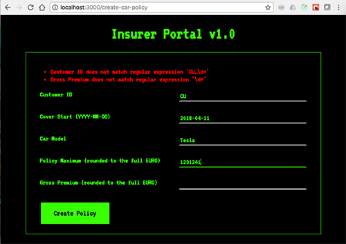
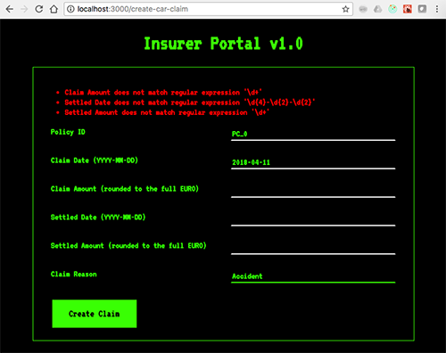

## Screens

### Create Car Insurance Policy

With the "Create Car Insurance Policy' screen a new policy can be created. The form cannot be submitted until all validation errors are fixed.



### Create Car Insurance Claim

With the "Create Car Insurance Claim' screen a new claim can be created. The form cannot be submitted until all validation errors are fixed.



## Development and Test

For Development: Create a file called `.env` in the root directory providing the IP:PORT of the mainframe service (or create an environment variable), e.g.:
```
REACT_APP_API=35.242.150.158:8080
```

Run the application via `npm run start`. It will automatically read the values from `.env`.

Notes:
* Assumption is that the first command is executed from the directory `mainframe-portal`
* `npm install` is only required for the first time or when dependencies change
* The proper location of the mainframe service needs to be passed as an environment variable `REACT_APP_API`

```
host$ docker run -it --rm -v $(pwd):/home/app -p 3000:3000 -e "REACT_APP_API=YOUR_IP_HERE:PORT" node:9.5 /bin/bash
container$ cd /home/app
container$ npm install
container$ npm start
```

Open a browser pointing at http://localhost:3000/

## Production build

In order to create a production build run the following command from the directory `mainframe-portal`. This will create a folder named `build`.

```
host$ docker run -it --rm -v $(pwd):/home/app -w /home/app node:9.5 /bin/bash -c "npm install; npm run build"
host$ tree -L 2 build/
build/
├── asset-manifest.json
├── favicon.ico
├── index.html
├── manifest.json
├── service-worker.js
└── static
    ├── css
    ├── js
    └── media
```

### Package Docker container

**Note: This is not ideal, as it starts the development server. The better way is to use a HTTP server like nginx with the production build**

The repository includes a Dockerfile to package the mainframe-portal as container.

Replace `ckurze/mainframe-portal` with whatever name you like:
```
host$ docker build -t ckurze/mainframe-portal .
```

Optionally, push into the docker repository:
```
docker login

docker push ckurze/mainframe-portal
```

## Run the Service

After building the docker image, it can be run with:
```
host$ docker run -d -p 3000:3000 -e "REACT_APP_API=YOUR_IP_HERE:PORT" --name=mainframe-portal ckurze/mainframe-portal
```

Open a browser pointing at http://localhost:3000/

Kill the container with
```
host$ docker rm -f mainframe-portal
```

## Run on minikube

The repository includes Kubernetes manifests to create a deployment and expose a service.

Deploying to minikube
```
host$ minikube start
host$ kubectl apply -f packaging/deployment.yaml
host$ kubectl apply -f packaging/service.yaml
host$ minikube ip
192.168.99.100
```

You should then be able to open a browser and reach the application on http://192.168.99.100:30100


